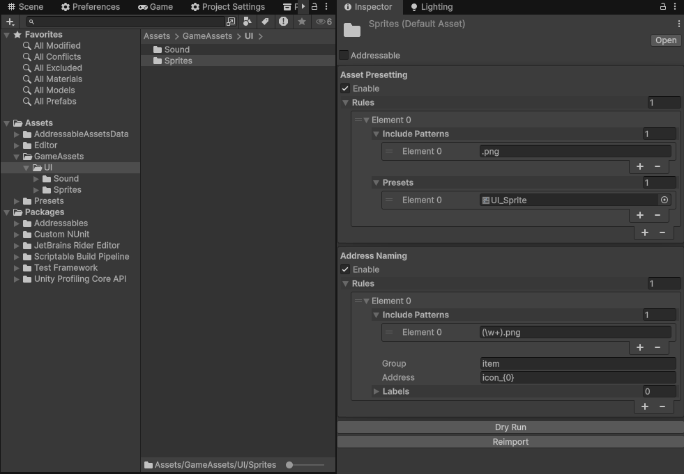

# FolderAssetImporter

A Unity Editor library that automatically applies **Presets** and **Addressable addresses** to assets under a folder.

---

## Overview

In large Unity projects, manually configuring import settings and Addressable addresses for every texture, audio clip, or prefab is tedious and error-prone. FolderAssetImporter lets you define rules directly on a folder — any asset imported or moved into that folder is automatically processed.



---

## Features

- **Preset auto-apply** — Apply one or more Unity Presets to asset importers matching a regex pattern (e.g. TextureImporter, AudioImporter, ModelImporter).
- **Addressable address auto-set** — Automatically assign an Addressable group, address, and labels to assets matching a regex pattern. Supports capture groups for dynamic address generation via `string.Format`.
- **Import & Move detection** — Hooks into `AssetPostprocessor` (`OnPostprocessAllAssets`) to catch both newly imported and moved assets.
- **Dry Run** — Preview which rules would apply and what addresses would be assigned without actually modifying assets.
- **Reimport** — Reprocess all assets under the folder on demand.
- **Copy / Paste / Clear** — Folder settings can be copied between folders via the context menu.

---

## Requirements

| | |
|---|---|
| Unity | 2021.3 or later (LTS recommended) |
| Addressables *(optional)* | com.unity.addressables — enable with scripting define `ENABLE_ADDRESSABLES` |

> The Addressable address feature is only active when the `ENABLE_ADDRESSABLES` scripting define symbol is set.

---

## Installation

### via Unity Package Manager (Git URL)

1. Open **Window > Package Manager**
2. Click **+** → **Add package from git URL...**
3. Enter the following URL:

```
https://github.com/kurobon-jp/FolderAssetImporter.git?path=Assets
```

### Manual

Clone or download this repository and copy the `Assets/` folder into your project's `Assets` directory.

---

## Usage

### 1. Select a folder

Select the target folder in the Project window. The Inspector will show **Asset Presetting** and **Address Naming** sections, added by the `DefaultAssetEditor` extension.

### 2. Configure Asset Presetting

Toggle **Enable** on and add entries to **Rules**.

Each rule (`AssetPresettingRule`) has the following fields:

| Field | Description |
|---|---|
| `Include Patterns` | Regex patterns to filter target asset paths (multiple allowed) |
| `Presets` | Unity Presets to apply (multiple allowed, applied in order) |

**Example:**

| Include Pattern | Preset |
|---|---|
| `\.png$` | TextureImporter_UI |
| `\.wav$` | AudioImporter_SE |

### 3. Configure Address Naming *(requires `ENABLE_ADDRESSABLES`)*

Toggle **Enable** on and add entries to **Rules**.

Each rule (`AddressNamingRule`) has the following fields:

| Field | Description |
|---|---|
| `Include Patterns` | Regex patterns to filter target asset paths (capture groups supported) |
| `Group` | Addressable group name — created automatically if it does not exist |
| `Address` | Address string. Use `{0}`, `{1}`, … to reference regex capture groups |
| `Labels` | Labels to assign. Use `{0}`, `{1}`, … to reference regex capture groups |

**Dynamic address generation with capture groups:**

Include Pattern:
```
Assets/Textures/(\w+)/(\w+)\.png
```
Address:
```
{0}/{1}
```
Importing `Assets/Textures/UI/button.png` produces the address `UI/button`.

### 4. Dry Run / Reimport

| Button | Behavior |
|---|---|
| **Dry Run** | Logs which rules would match and what addresses would be set, without modifying any assets |
| **Reimport** | Re-applies all rules to every asset under the folder |

### 5. Context menu

Right-click a folder → **CONTEXT > DefaultAsset**:

| Item | Behavior |
|---|---|
| **Clear** | Reset all settings on the folder |
| **Copy** | Copy settings to the clipboard |
| **Paste** | Paste copied settings onto the folder |

---

## How It Works

```
Asset imported or moved
        ↓
FolderAssetProcessor (AssetPostprocessor)
  └─ OnPostprocessAllAssets
        ↓
FolderAssetImportSetting.Import(assetPath)
  ├─ AssetPresettingRule.Apply()
  │    ├─ Match asset path against Include Patterns
  │    ├─ Preset.ApplyTo(AssetImporter)
  │    └─ importer.SaveAndReimport()
  └─ AddressNamingRule.Apply()        (ENABLE_ADDRESSABLES only)
       ├─ Match asset path against Include Patterns (capture groups)
       ├─ Find or create Addressable group
       └─ Create/move entry, set address and labels
```

`FolderAssetProcessor` returns `int.MaxValue` from `GetPostprocessOrder()`, ensuring it runs after all other `AssetPostprocessor` implementations.

---

## License

This project is licensed under the **MIT License**. See [LICENSE](LICENSE) for details.
